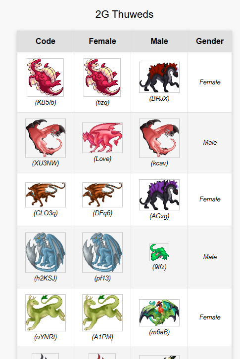

# Usage

This assumes you have your 2G Thuweds and Salts already neatly organised into groups.

To start with, you'll need to install NodeJS. For Windows, you can get it from here: [nodejs.org/en/download](https://nodejs.org/en/download)

You should take note of where you installed the executable, because you need it to run the scripts. Make sure you tick the "add to path" in the installer.

For Linux and Mac users, you probably already know what you're doing.

1. Copy `config.example` to `config`.
2. Put your API key, salt group id and thuwed group id in.
3. `npm run all` to generate all of the files. You can refer to `package.json` to run individual exports. On Windows, you should open Powershell in this directory
4. You'll see `.html` files in the `build` directory. Open them in your web browser.

If you did everything right, they'll look similar to this:

